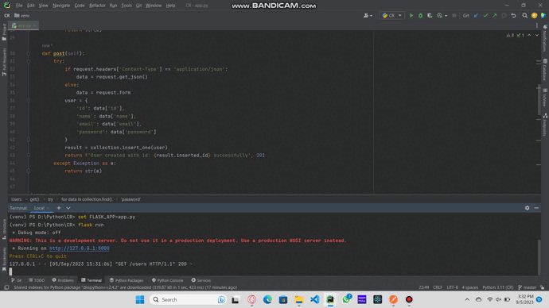
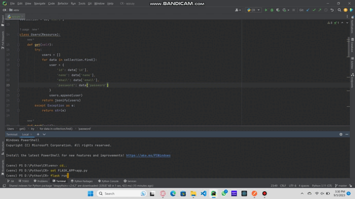
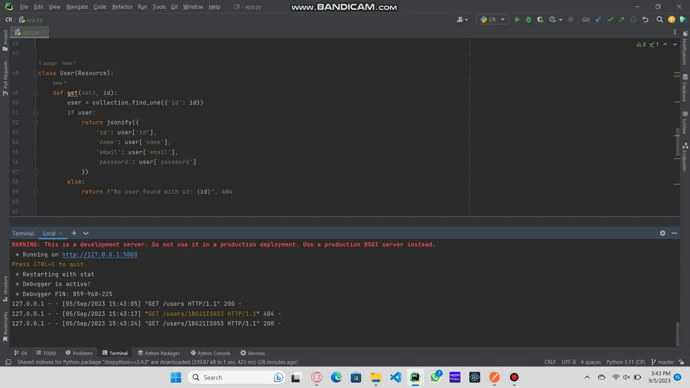
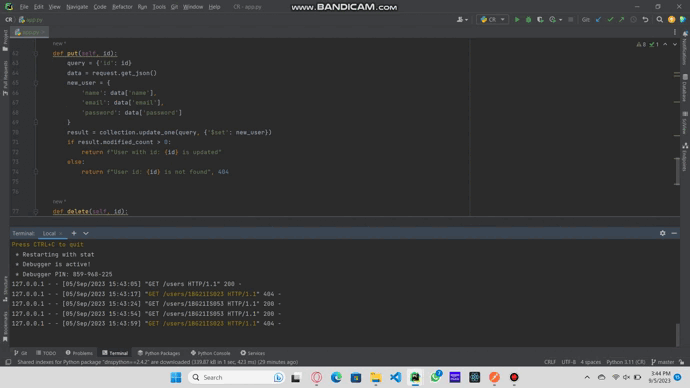
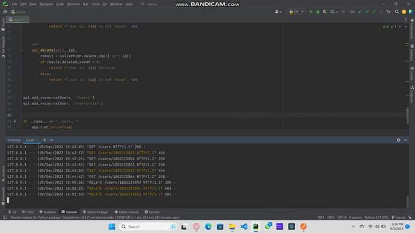
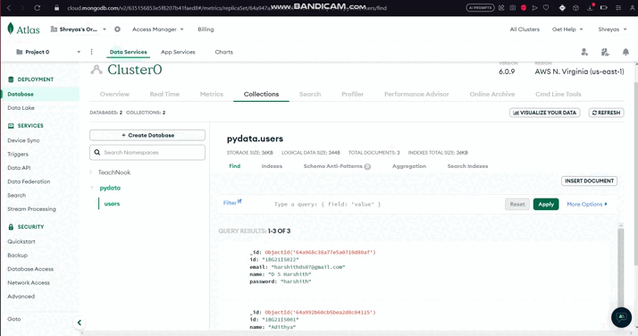

# Python Application for CRUD Operations on MongoDB

This is an application that provides a REST API for performing CRUD (Create, Read, Update, Delete) operations on a MongoDB database. The application allows you to manage user resources.

## Features

- Create a new user
- Retrieve all users details
- Retrieve user details by ID
- Update user details
- Delete a user

## Requirements

- Python 3.x
- Flask
- Flask-restful
- PyMongo
- MongoDB
- Postman(Optional)
- Docker Desktop(Optional)

## Installation

1. Clone or fork the repository

2. Change into the project directory

3. Install the required dependencies:
- flask
- flask-restful
- pymongo

4. Set up MongoDB:
- Install MongoDB on your system.
- Start the MongoDB server.

5. Configuration:
- Open the `app.py` file in a code editor.
- Set the MongoDB URI (username and password) and database name in the Flask application configuration.
- Save the changes.

## Run the Application

1) Using Flask:
- In your terminal, run "set FLASK_APP=app.py"
- In your terminal, run "flask run"
- The Flask application will be running on `http://localhost:5000` or `http://127.0.0.1:5000/`. You can access the API endpoints using HTTP requests.

-----------------------------------------OR-----------------------------------------

2) Docker Desktop:
- In your terminal, run "docker build -t myapp ."
- after completing, run "docker run -p 5000:5000 myapp"

## API Endpoints

- **Create User**
- Endpoint: `POST /users`
- Request Body: JSON data with user details (id, name, email, password)
- Response: JSON data with a success message and the created user's ID

- **Get All Users**
- Endpoint: `GET /users/<id>`
- Response: JSON data with all users details (id, name, email, password) or an error message if the user is not found

- **Get User By ID**
- Endpoint: `GET /users/<id>`
- Response: JSON data with user details (id, name, email, password) or an error message if the user is not found

- **Update User by ID**
- Endpoint: `PUT /users/<id>`
- Request Body: JSON data with updated user details (name, email, password)
- Response: JSON data with a success message and the updated user's ID

- **Delete User by ID**
- Endpoint: `DELETE /users/<id>`
- Response: JSON data with a success message or an error message if the user is not found

## Examples

- Open Postman and create a new request.
- Enter the request URL, such as http://localhost:5000/users.

**To create a new user**:
- Set the HTTP method to `POST`.
- Go to the "Headers" tab.
- Add a new header with the key Content-Type and the value application/json.
- Go to the "Body" tab.
- Select the "Raw" option.
- From the dropdown next to "Raw," choose JSON (application/json).
- Enter the JSON data in the request body.
- Once you've entered the necessary details, click the "Send" button to send the POST request with the data in the request body.
- Postman will display the response from the server, including the status code and any response data or error messages.
- Demo video to create a new user:

**To get all the users**:
- Set the HTTP method to `GET`.
- Click the "Send" button to create the GET request in the request body
- Postman will display the response from the server, including the status code and any response data or error messages.
- Demo video to get the users:

**To get a user by ID**:
- Set the HTTP method to `GET`.
- Add the ID to the URL.
- Click the "Send" button to create the GET request in the request body
- Postman will display the response from the server, including the status code and any response data or error messages.

**To update the users**:
- Set the HTTP method to `PUT`.
- Add the ID to the URL.
- Click the "Send" button to send the PUT request in the request body
- Postman will display the response from the server, including the status code and any response data or error messages.

**To delete the users**:
- Set the HTTP method to `DELETE`.
- Add the ID to the URL.
- Click the "Send" button to send the DELETE request in the request body
- Postman will display the response from the server, including the status code and any response data or error messages.

**This is the Mongo Database**

